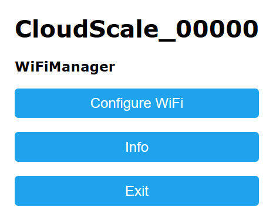
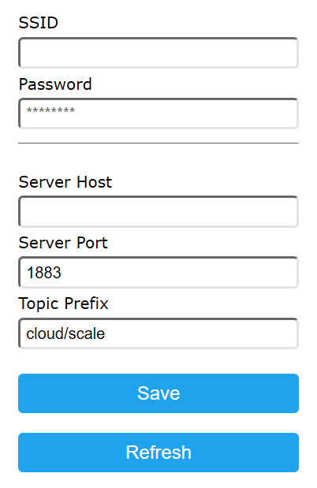

# Cloud Scale

This prototype project integrates for IoT:

* 1 kOhm pontentiometer
* [Ublox NEO-6 GPS](https://www.u-blox.com/sites/default/files/products/documents/NEO-6_DataSheet_(GPS.G6-HW-09005).pdf)

It is based on ESP device connecting to the sensors mentioned above.

## MQTT Messages

The device and its Android-based applications use the MQTT protocol for information exchange. The message topics start from `cloud/scale/id` where `id` is
the device ID.

### cloud/scale/id/weight

The device publishes the weight value. Payload is a JSON object:
* `value`: current weight value in kg.

### cloud/scale/id/global_position

The device publishes the global position value. Payload is a JSON object:
* `latitude`: latitude part of the current position; it varies from -90 to 90.
* `longitude`: longitude part of the current position; it varies from -180 to 180.

## Connections

### WEMOS D1 Mini

Pontentiometer | ESP8266
---------------|--------
End            | 3.3V
Wiper          | A0
End            | GND

GPS | ESP8266
----|--------
VCC | 5V
RX  | D2 (GPIO4)
TX  | D1 (GPIO5)
GND | GND

### ESP32

Pontentiometer | ESP32
---------------|--------
End            | 3.3V
Wiper          | GPIO34
End            | GND

GPS | ESP32
----|--------
VCC | 5V
RX  | GPIO17 (TX2)
TX  | GPIO16 (RX2)
GND | GND

## Configuration

The board initially creates a temporary wireless network with name `CloudScale_xxxxx`. Connect to this network and open the Wi-Fi Manager by navigating to
web page `192.168.4.1`.

Click `Configure WiFi` button on the page. After opening a new page, enter `SSID` (alternatively, one can select it from available wireless networks)
and `Password` of the wireless network being used later to access the Internet.

Enter `Server Host` and `Server Port` if needed. Do not change `Topic Prefix`, it should be always `cloud/scale`.

Finally, the board reboots and connects to the permanent network selected above.

The configuration procedure will restart after rebooting if the currently selected wireless network gets offline. It can be forced by sending `RST`
command to the board via USB cable in a serial monitor.
